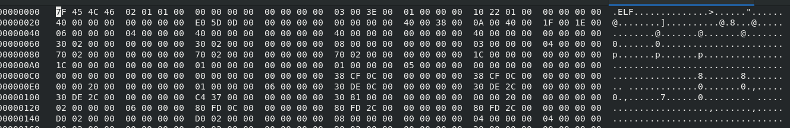
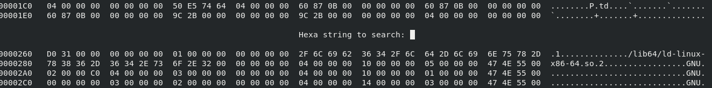

# Como esconder Banner do SSH

## Instale o hexedit

    apt-get update $$ apt-get install hexedit

## Faça backp do Binário SSH

    cp -p /usr/sbin/sshd /tmp/sshd.bkp
    cp -p /usr/sbin/sshd /tmp/sshd.novo

## Atualize o Binário com o hexedit

    # hexedit /tmp/sshd.novo

Pressione 'TAB' para mudar para a coluna ASCII  

Use CTRL + S para exibir a pesquisa e procure o texto que você deseja ocultar. Por exemplo "OpenSSH_8.0"

Você verá algo parecido com isso:

Use as teclas para destacar o inicio da sequência, e digite o texto que deseja substituir.

Tenha cuidado para permanecer dentro dos limites do banner original.

Depois de alteraado, salve com CTRL +x e Y.

## Atualize o sshd e reinicie o serviço.

    #rm /usr/sbin/sshd
    cp -p /tmp/sshd.novo /usr/sbin/sshd
    systemctl restart sshd

## Verifique se consegue fazer o SSH.

Para verificar se consegue fazer o ssh e se a informação do banner sumiu, basta executar o comando:

    ssh -vv user@ip

Obs: Pode ser prudente criar uma tarefa na cron para restauração do bakckup do arquivo, caso algo de errado.

